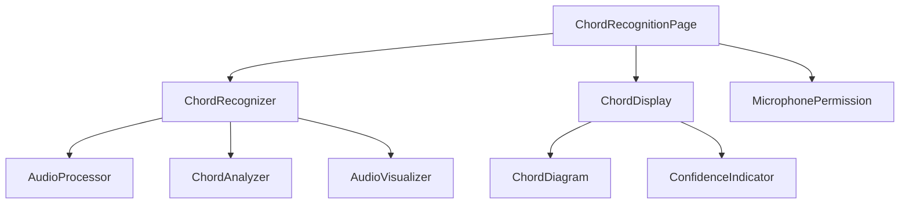
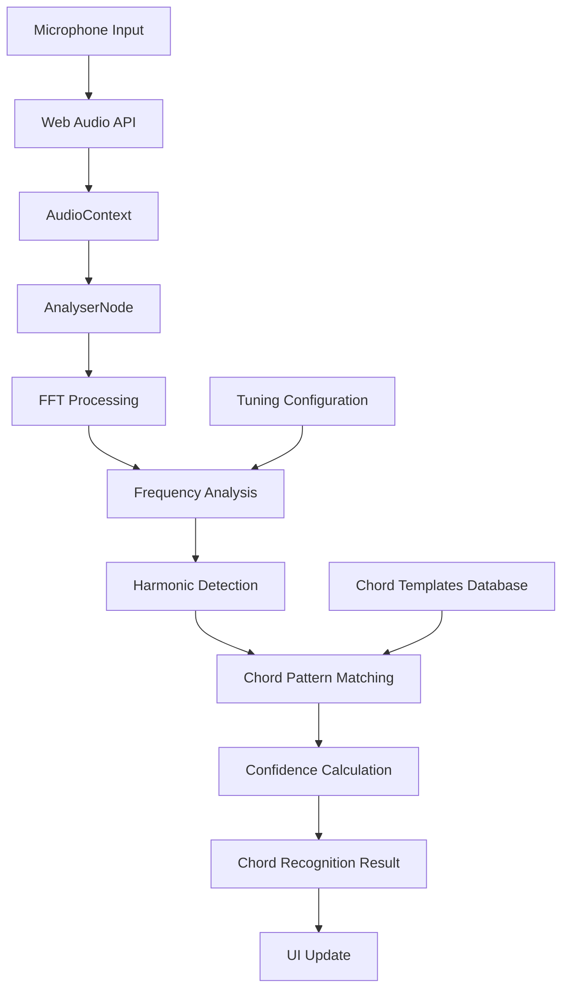

# Ukulele Chord Recognition Feature Design

## Overview

This design outlines the implementation of a real-time ukulele chord recognition feature for the bryam application. The feature will capture audio from the user's microphone, analyze the frequency spectrum, and identify the chord being played on a ukulele using web-based audio processing and machine learning techniques.

**Core Value Proposition**: Enable users to learn and practice ukulele by providing instant feedback on the chords they play, bridging the gap between theoretical chord knowledge and practical playing skills.

**User Journey**:
1. User navigates to the chord recognition page
2. User grants microphone permission
3. User plays a chord on their ukulele
4. System analyzes the audio in real-time
5. System displays the recognized chord with confidence level

## Technology Stack & Dependencies

**New Dependencies Required**:
```json
{
  "dependencies": {
    "ml-matrix": "^6.10.8",
    "ml-fft": "^1.3.8"
  },
  "devDependencies": {
    "@types/dom-mediacapture-record": "^1.0.18"
  }
}
```

**Browser APIs**:
- Web Audio API (MediaDevices.getUserMedia, AudioContext, AnalyserNode)
- MediaDevices API for microphone access
- RequestAnimationFrame for real-time processing

**Machine Learning Approach**:
- Frequency domain analysis using Fast Fourier Transform (FFT)
- Harmonic pattern matching for chord identification
- Template-based chord recognition using pre-defined frequency patterns

## Component Architecture

### Component Hierarchy



### Component Definitions

#### ChordRecognitionPage (`src/routes/chord-recognition/+page.svelte`)
**Purpose**: Main page component that orchestrates the chord recognition feature
**Props**: None
**State**: 
- `currentChord: RecognizedChord | null`
- `isRecording: boolean`
- `permissionGranted: boolean`

#### ChordRecognizer (`src/lib/components/ChordRecognizer.svelte`)
**Purpose**: Core component that handles audio capture and chord analysis
**Props**: 
- `onChordRecognized: (chord: RecognizedChord) => void`
- `isActive: boolean`
**State**:
- `audioContext: AudioContext | null`
- `analyser: AnalyserNode | null`
- `mediaStream: MediaStream | null`

#### ChordDisplay (`src/lib/components/ChordDisplay.svelte`)
**Purpose**: Displays the currently recognized chord with visual feedback
**Props**:
- `chord: RecognizedChord | null`
- `isListening: boolean`

#### AudioProcessor (`src/lib/utils/audioProcessor.ts`)
**Purpose**: Utility class for audio processing and FFT analysis
**Methods**:
- `processAudioFrame(frequencies: Float32Array): FrequencyData`
- `detectFundamentalFrequency(data: FrequencyData): number`
- `extractHarmonics(fundamentalFreq: number, data: FrequencyData): Harmonic[]`

#### ChordAnalyzer (`src/lib/utils/chordAnalyzer.ts`)
**Purpose**: Analyzes frequency data to identify chords
**Methods**:
- `analyzeChord(harmonics: Harmonic[]): RecognizedChord | null`
- `matchChordPattern(harmonics: Harmonic[]): ChordMatch[]`
- `calculateConfidence(match: ChordMatch): number`

## Data Models & Types

```typescript
// src/lib/types.ts additions

export interface RecognizedChord {
  name: string // e.g., "C", "Am", "F", "G7"
  type: ChordType
  confidence: number // 0-1
  frequencies: number[] // detected frequencies
  rootNote: string
  quality: ChordQuality
}

export enum ChordType {
  MAJOR = 'major',
  MINOR = 'minor',
  SEVENTH = 'seventh',
  DIMINISHED = 'diminished',
  AUGMENTED = 'augmented'
}

export enum ChordQuality {
  PERFECT = 'perfect',
  GOOD = 'good',
  FAIR = 'fair',
  POOR = 'poor'
}

export interface FrequencyData {
  frequencies: Float32Array
  magnitude: Float32Array
  sampleRate: number
  timestamp: number
}

export interface Harmonic {
  frequency: number
  amplitude: number
  note: string
}

export interface ChordMatch {
  chordName: string
  score: number
  harmonics: Harmonic[]
}

export interface ChordTemplate {
  name: string
  type: ChordType
  intervals: number[] // semitone intervals from root
  frequencies: number[] // expected frequencies for C tuning
}
```

## Business Logic Layer

### Chord Recognition Architecture



### Core Processing Pipeline

1. **Audio Capture**: Use `getUserMedia()` to access microphone
2. **Real-time Analysis**: Process audio frames at 60fps using `requestAnimationFrame`
3. **Frequency Domain Conversion**: Apply FFT to convert time domain to frequency domain
4. **Peak Detection**: Identify dominant frequencies in the spectrum
5. **Harmonic Analysis**: Group frequencies into harmonic series
6. **Chord Matching**: Compare detected harmonics against chord templates
7. **Confidence Scoring**: Calculate match confidence based on harmonic accuracy

### Chord Template System

**Standard Ukulele Tuning (G-C-E-A)**:
```typescript
// src/lib/data/chordTemplates.ts
export const UKULELE_CHORD_TEMPLATES: ChordTemplate[] = [
  {
    name: 'C',
    type: ChordType.MAJOR,
    intervals: [0, 4, 7], // C-E-G
    frequencies: [261.63, 329.63, 392.00] // C4, E4, G4
  },
  {
    name: 'Am',
    type: ChordType.MINOR,
    intervals: [0, 3, 7], // A-C-E
    frequencies: [220.00, 261.63, 329.63] // A3, C4, E4
  },
  // ... additional chord templates
]
```


## State Management

### Chord Recognition Store

```typescript
// src/lib/stores/chordRecognitionStore.ts
import { writable, derived } from 'svelte/store'

interface ChordRecognitionState {
  isRecording: boolean
  currentChord: RecognizedChord | null
  audioPermission: 'granted' | 'denied' | 'pending'
  error: string | null
}

export const chordRecognitionState = writable<ChordRecognitionState>({
  isRecording: false,
  currentChord: null,
  audioPermission: 'pending',
  error: null
})

// Derived stores
export const isListening = derived(
  chordRecognitionState,
  $state => $state.isRecording && $state.audioPermission === 'granted'
)

export const canStartRecording = derived(
  chordRecognitionState,
  $state => $state.audioPermission === 'granted' && !$state.isRecording
)
```

## Routing & Navigation

### Route Structure

```typescript
// src/routes/chord-recognition/+page.svelte
// Simple client-side only page without server-side data loading
```

### Navigation Integration

```svelte
<!-- src/lib/components/Navigation.svelte addition -->
<nav class="navbar bg-base-100">
  <!-- existing navigation items -->
  <a href="/chord-recognition" class="btn btn-ghost">
    🎸 Chord Recognition
  </a>
</nav>
```

## Styling Strategy

### Tailwind + DaisyUI Components

**Theme Alignment**: Follow existing bryam design system using DaisyUI components

**Key UI Elements**:
- `btn-primary` for start/stop recording
- `card` components for chord display
- `progress` bars for confidence indicators
- `badge` elements for chord types
- `alert` components for permission/error states

### Responsive Design

```svelte
<!-- Mobile-first responsive design -->
<div class="container mx-auto p-4">
  <div class="max-w-2xl mx-auto">
    <!-- Chord Recognition Panel -->
    <ChordRecognizer />
    <ChordDisplay />
  </div>
</div>
```

## Testing Strategy

### Unit Testing

**Test Coverage Requirements**:
- Audio processing utilities (audioProcessor.ts)
- Chord analysis logic (chordAnalyzer.ts)
- Component state management

```typescript
// src/lib/utils/chordAnalyzer.test.ts
import { describe, it, expect, vi } from 'vitest'
import { ChordAnalyzer } from './chordAnalyzer'

describe('ChordAnalyzer', () => {
  it('should identify C major chord correctly', () => {
    const analyzer = new ChordAnalyzer()
    const harmonics = [
      { frequency: 261.63, amplitude: 0.8, note: 'C' },
      { frequency: 329.63, amplitude: 0.6, note: 'E' },
      { frequency: 392.00, amplitude: 0.7, note: 'G' }
    ]
    
    const result = analyzer.analyzeChord(harmonics)
    
    expect(result?.name).toBe('C')
    expect(result?.type).toBe(ChordType.MAJOR)
    expect(result?.confidence).toBeGreaterThan(0.8)
  })
})
```

### Integration Testing

**Browser API Mocking**:
```typescript
// src/lib/components/ChordRecognizer.test.ts
import { vi } from 'vitest'

// Mock Web Audio API
const mockGetUserMedia = vi.fn()
Object.defineProperty(navigator, 'mediaDevices', {
  value: { getUserMedia: mockGetUserMedia }
})

const mockAudioContext = vi.fn(() => ({
  createAnalyser: vi.fn(() => ({
    fftSize: 2048,
    getFloatFrequencyData: vi.fn()
  }))
}))
global.AudioContext = mockAudioContext
```

### Performance Testing

**Audio Processing Benchmarks**:
- FFT computation performance (target: <16ms per frame)
- Memory usage monitoring during continuous recording
- Chord recognition accuracy testing with sample audio files

## Security & Privacy Considerations

### Microphone Permission Handling

```typescript
// src/lib/utils/microphonePermission.ts
export class MicrophonePermission {
  async requestPermission(): Promise<'granted' | 'denied'> {
    try {
      const stream = await navigator.mediaDevices.getUserMedia({ audio: true })
      stream.getTracks().forEach(track => track.stop()) // Clean up
      return 'granted'
    } catch (error) {
      if (error.name === 'NotAllowedError') {
        return 'denied'
      }
      throw error
    }
  }
}
```

### Data Privacy

- **Local Processing**: All audio processing happens in the browser
- **No Audio Storage**: Raw audio data is never stored or transmitted
- **No Data Collection**: Chord recognition results are displayed only and not saved
- **User Consent**: Clear permission requests and privacy notices

## Performance Optimization

### Audio Processing Optimization

```typescript
// src/lib/utils/performanceOptimizer.ts
export class AudioPerformanceOptimizer {
  private processingQueue: Float32Array[] = []
  private isProcessing = false
  
  async processAudioFrame(audioData: Float32Array): Promise<void> {
    // Use requestIdleCallback for non-critical processing
    if ('requestIdleCallback' in window) {
      requestIdleCallback(() => this.analyzeAudio(audioData))
    } else {
      // Fallback for browsers without requestIdleCallback
      setTimeout(() => this.analyzeAudio(audioData), 0)
    }
  }
}
```

### Memory Management

- **Buffer Reuse**: Reuse FFT buffers to minimize garbage collection
- **Batch Processing**: Process multiple audio frames together when possible
- **Resource Cleanup**: Properly dispose of AudioContext and MediaStream objects

## Error Handling

### Graceful Degradation

```typescript
// src/lib/utils/errorHandling.ts extensions
export enum ChordRecognitionError {
  MICROPHONE_ACCESS_DENIED = 'microphone_access_denied',
  AUDIO_CONTEXT_FAILED = 'audio_context_failed',
  PROCESSING_ERROR = 'processing_error',
  UNSUPPORTED_BROWSER = 'unsupported_browser'
}

export function handleChordRecognitionError(error: unknown): string {
  if (error instanceof DOMException) {
    switch (error.name) {
      case 'NotAllowedError':
        return 'Microphone access denied. Please grant permission to use this feature.'
      case 'NotFoundError':
        return 'No microphone found. Please connect a microphone and try again.'
      default:
        return 'Audio access error. Please check your microphone settings.'
    }
  }
  
  return 'An unexpected error occurred during chord recognition.'
}
```

## Browser Compatibility

### Feature Detection

```typescript
// src/lib/utils/browserSupport.ts
export function checkBrowserSupport(): {
  supported: boolean
  missing: string[]
} {
  const missing: string[] = []
  
  if (!navigator.mediaDevices?.getUserMedia) {
    missing.push('MediaDevices API')
  }
  
  if (!window.AudioContext && !window.webkitAudioContext) {
    missing.push('Web Audio API')
  }
  
  if (!window.requestAnimationFrame) {
    missing.push('RequestAnimationFrame')
  }
  
  return {
    supported: missing.length === 0,
    missing
  }
}
```

### Progressive Enhancement

- **Fallback UI**: Show feature unavailable message for unsupported browsers
- **Polyfills**: Include necessary polyfills for older browsers
- **Graceful Degradation**: Allow core app functionality without chord recognition

This design provides a comprehensive foundation for implementing real-time ukulele chord recognition while maintaining consistency with the existing bryam application architecture and following domain-driven design principles.